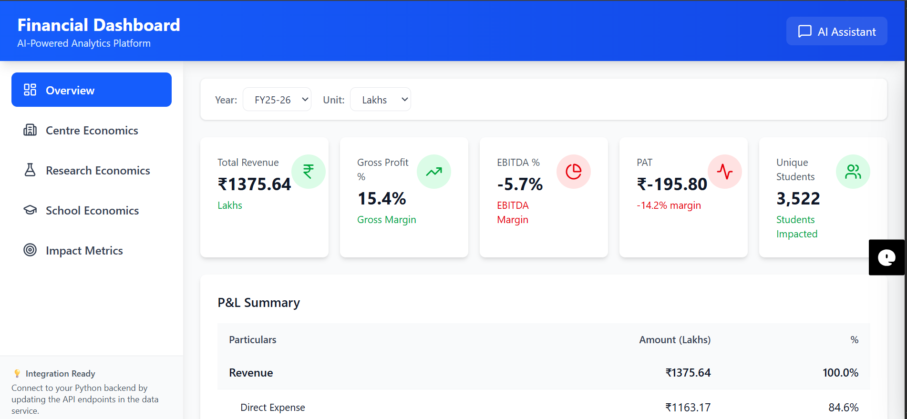

# 💹 Financial Dashboard with AI-Powered Insights

A full-stack financial analytics dashboard built with **React**, **TypeScript**, 
and **Node.js**, featuring an AI-powered chat assistant using 
**Retrieval-Augmented Generation (RAG)** to answer questions about your 
financial data in natural language.



---

## ✨ Features

- 📊 **Interactive Charts** — Visualize revenue, expenses, and profit trends
- 🤖 **AI Chat Assistant** — Ask questions about your financial data in plain English
- 🧠 **RAG (Retrieval-Augmented Generation)** — AI answers are grounded in your 
  actual financial data using ChromaDB
- 🗄️ **MySQL Database** — Stores and retrieves structured financial records
- 🔍 **Smart Search** — Semantic search across your financial documents
- 📱 **Responsive Design** — Works on desktop and mobile
- ⚡ **Fast Performance** — Built with Vite for lightning-fast load times

---

## 🛠️ Tech Stack

### Frontend
| Technology | Purpose |
| :--- | :--- |
| React 18 | UI Framework |
| TypeScript | Type Safety |
| Vite | Build Tool |
| TailwindCSS | Styling |

### Backend
| Technology | Purpose |
| :--- | :--- |
| Node.js | Runtime |
| TypeScript | Type Safety |
| Express.js | API Server |
| MySQL2 | Database Driver |
| ChromaDB | Vector Database (RAG) |

### AI / ML
| Technology | Purpose |
| :--- | :--- |
| ChromaDB | Vector Storage & Semantic Search |
| OpenAI API | Language Model for AI Chat |

---

## 📁 Project Structure
Financial-Dashboard/
├── src/ # React Frontend
│ ├── components/ # Reusable UI Components
│ │ ├── charts/ # Chart Components
│ │ ├── dashboard/ # Dashboard Widgets
│ │ └── chat/ # AI Chat Interface
│ ├── pages/ # Page Components
│ ├── api.ts # Centralized API calls
│ ├── types.ts # TypeScript Interfaces
│ └── main.tsx # Entry Point
│
├── backend/ # Node.js Backend
│ ├── src/
│ │ ├── routes/ # API Routes
│ │ ├── controllers/ # Business Logic
│ │ ├── db/ # Database Connection
│ │ └── rag/ # RAG Implementation
│ ├── package.json
│ └── tsconfig.json
│
├── docs/ # Documentation & Screenshots
├── index.html # HTML Entry Point
├── package.json # Frontend Dependencies
├── vite.config.ts # Vite Configuration
├── tsconfig.json # TypeScript Configuration
├── .env.example # Environment Variable Template
├── README.md # You are here!
├── SETUP.md # Detailed Setup Guide
├── CHANGES.md # Changelog
└── RAG_EXPLAINED.md # How the RAG system works


---

## 🚀 Getting Started

### Prerequisites

Make sure you have the following installed on your machine:

- [Node.js](https://nodejs.org/) (v18 or higher)
- [npm](https://www.npmjs.com/) (v9 or higher)
- [MySQL](https://www.mysql.com/) (v8 or higher)
- [Git](https://git-scm.com/)

---

### 1. Clone the Repository

```bash
git clone https://github.com/AnsariWahab/Financial-Dashboard.git
cd Financial-Dashboard